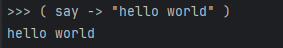

# Violence 🤬

A functional 🤑 first programming language with limited types and basic features.



# Install 😇

### Windows:

Go to [Github releases](https://github.com/0xleft/violence/releases/latest)

Download `violence_win_64.exe`

Rename it and use it in command line

### Linux:

```bash
curl -sSL https://raw.githubusercontent.com/0xleft/violence/master/install.sh | sudo sh
```

# Building from source

#### Build

##### Requirements:

```bash
sudo apt install -y build-essential cmake
```

```bash
git clone https://github.com/0xleft/violence.git
cd violence
# if you are not on linux you can use wsl or docker
cat build.sh
chmod +x build.sh
./build.sh <platform> # currently supported: linux
# move the binary to /usr/local/bin or to your PATH
# Enjoy :)
```

##### Run

You can run the program in two modes: file and interactive.

##### Modes:
1. File

```bash
violence <file>
```

2. Interactive

```bash
violence
```

# Docs

Visit docs [here](docs/README.md) 😱

### Variables

In Violence variables are declared using a type before them.

Types are:

- `lemon` for numbers
- `word` for strings
- `mood` for booleans

> **Note**
>
> In the future I plan to change lemon to char and have arrays as new type

```c
lemon a : 5
word b : "Hello World"
mood c : "good"
```

You can easely change between types for example when you want to print a number as a string you can do:

```c
lemon a : 5
word b : a
~ here b is now "5"
```

You can also change a string to a number:

```c
word a : "5"
lemon b : a
~ here b is now 5
```

This works for all types.

### Functions

#### Builtin functions

##### say

Print to stdout

```vio
( say -> "Hello World" )
```

##### ask

Read from stdin until newline

```vio
( ask -> "What is your name?" )
```

##### read

Read from a file

```vio
( read -> "file.txt" )
```

##### write

Write to a file

```vio
( write -> "file.txt" -> "Hello World" )
```

##### sheesh

Which stands for execute shell command

```vio
( sheesh -> "ls" )
```

##### exit

```vio
( exit )
```

### Examples

##### Hello World

```vio
( say -> "Hello World" )
```

##### FizzBuzz

```vio
f-> mod -> number -> mod_number -> lemon
    lemon output : number % mod_number
<-f

f-> fizzbuzz -> count -> max_count -> void
    lemon count = count + 1
    word output = ""

    if ( mod -> count -> 3 ) == 0
    word output = output + "fizz"

    if ( mod -> count -> 5 ) == 0
    word output = output + "buzz"

    word temp : count
    if output == ""
    ( say -> temp )

    if output != ""
    ( say -> output )

    if count <= max_count
    ( fizzbuzz -> count -> max_count )
<-f

( fizzbuzz -> 0 -> 10 )
```

##### Importing a file

```vio
( get -> "example/simple.vio" )

( function_from_simple_vio )
```

You can find more examples in [examples folder](https://github.com/0xleft/violence/tree/master/example)

# Contributing

Contributions are welcome!! 😎 If you want to contribute please create a pull request or if it is a big change create an issue first to discuss it.

# License

GPLv3